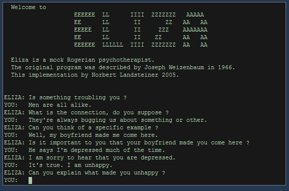
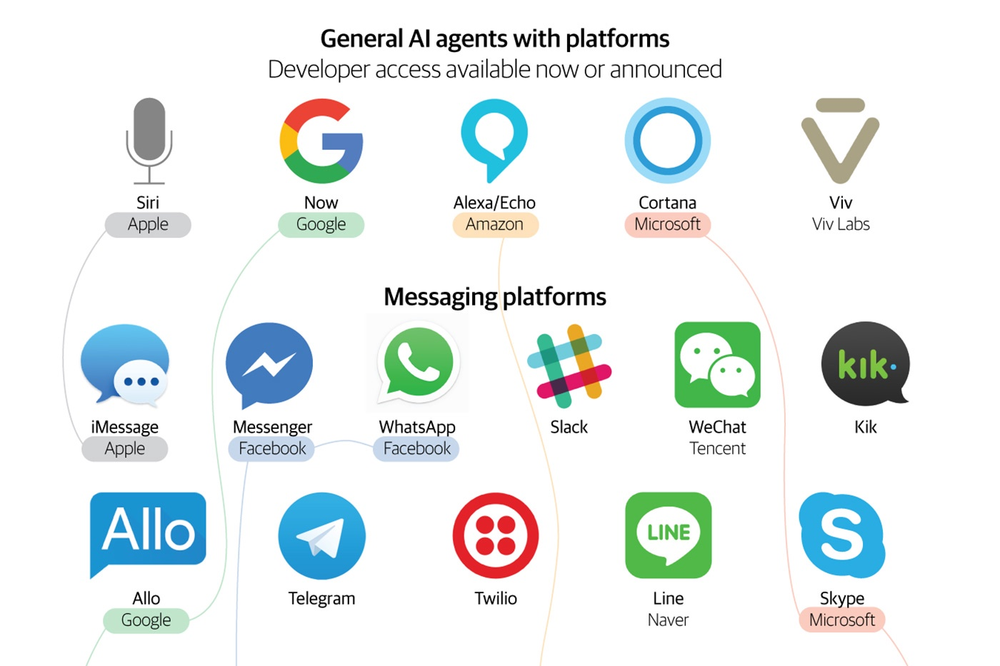
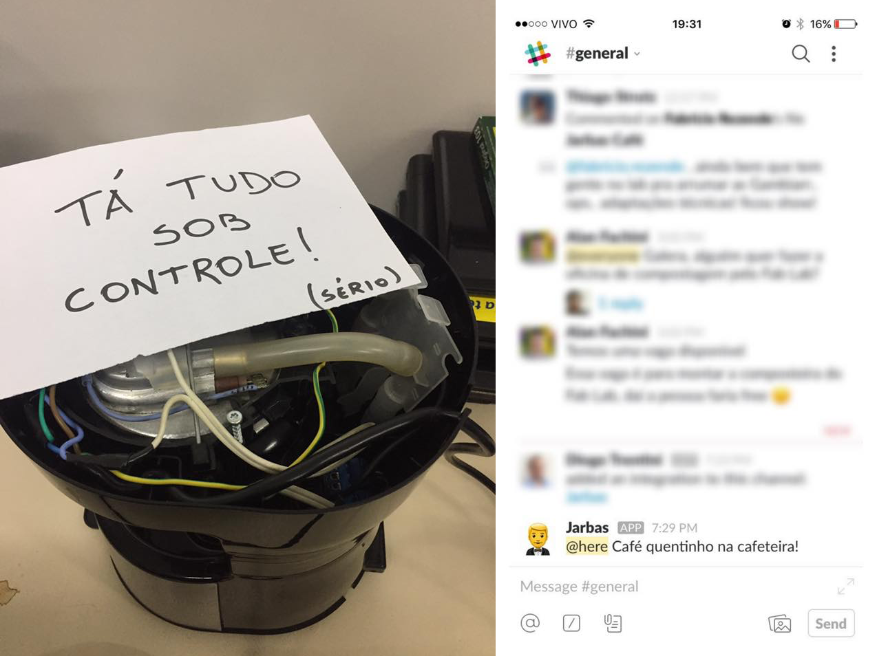
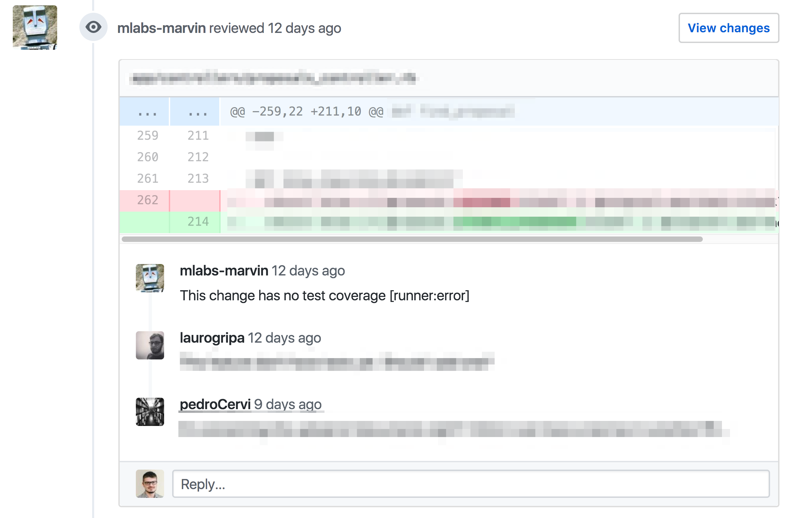
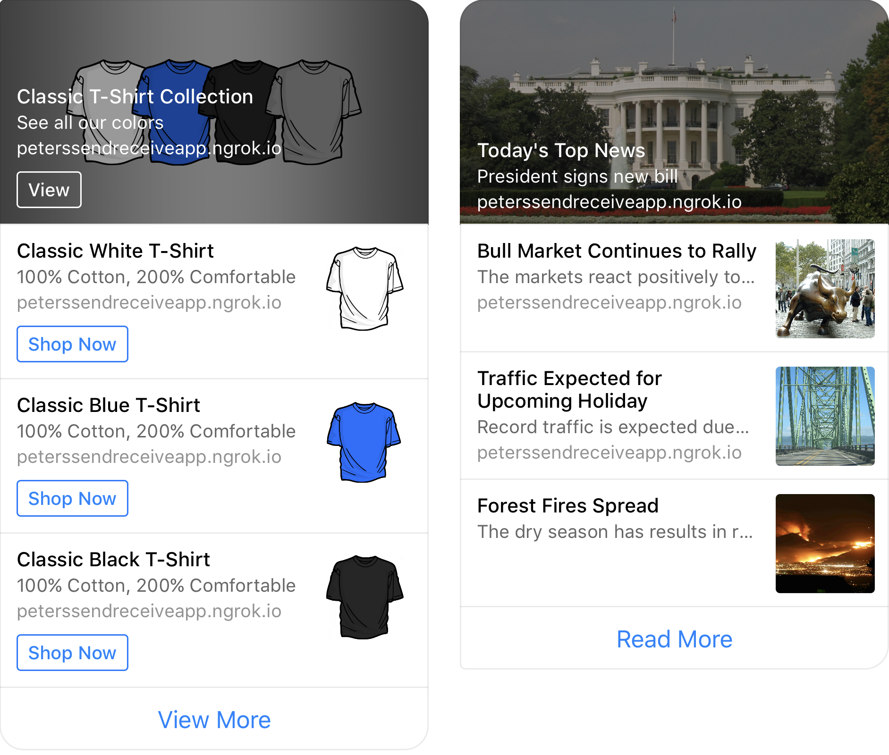
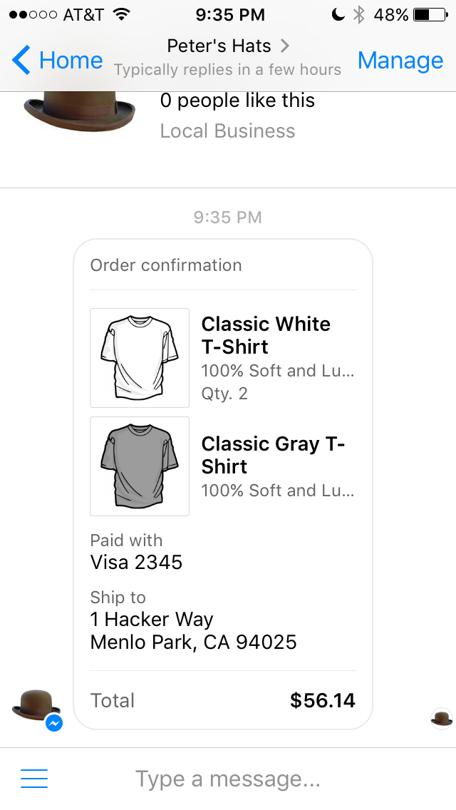
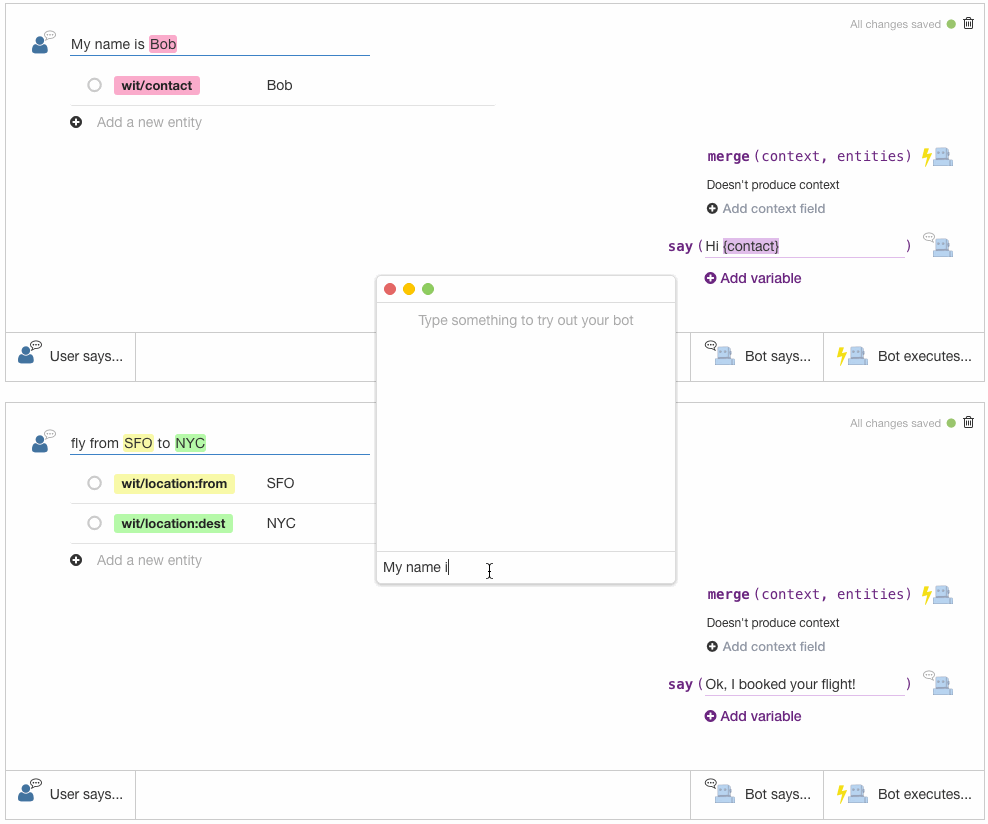

<!-- .slide: data-background-image="images/background.jpg" data-background-size="cover"; style="height: 100%" -->

### O Guia do Mochileiro dos **ChatBots**
<!-- .element: class="cover-title" -->

<div class="cover-bottom-logo">
  
  <p>www.magrathealabs.com</p>
</div>

Note: Vamos apresentar uma perspectiva de mercado, explicar os motivos pelo hype trending, o que é legal e o que não é, uma introdução técnica, guia de por onde caminhar e um demo de uma aplicação.

---

## **MLABS**

* Laboratório de Engenharia de Software
* ~ 9 meses: 12 engenheiros, designers e cara do negócio
* Braço de inovação
* Identificar dores no mercado

**Palavras-chave:**

Design de Produtos de Software, Engenharia de Software, Sistemas Distribuídos, Inteligência Artificial, Ciência de Dados.

---

## `/purpose`

> “[...] the future is already here, it’s just not very evenly distributed” ― William Gibson

<center>
`Transformar o futuro em presente`
</center>

<center>
[playbook.magrathealabs.com](http://playbook.magrathealabs.com)
</center>

---

### O QUE É UM **ChatBot?**

Uma interface de conversação baseada em instruções pré-definidas ou IA para acessar dados ou serviços.
<!-- .element: class="center" -->

---

## **hype**


Note: Existem a um bom tempo. Gráfico de interesse sobre o tópico "Bots" pelo Google Trends (2004 - 2017).

---

<!-- .slide: data-background-color="#212222" -->

## **trending**


Note: Messenger e WhatsApp 1.2 BI cada. Skype 300 Mi. Telegram 100 Mi. WeChat 889 Mi.

---

## **trending**

> “Facebook will now allow businesses to deliver automated customer support, e-commerce guidance, content and interactive experiences through chatbots” ― [TechCrunch](https://techcrunch.com/2016/04/12/agents-on-messenger/)

* App fatigue
* Plataformas de mensageria abriram suas APIs
* Redução no custo de desenvolvimento

Note: App fatigue - A "typical" consumer on average has 30 apps on his/her mobile device but uses less than five on a regular basis.
As early as two years ago almost two thirds of US smartphones users did not download a single app in a month

Support for chatbots by Facebook, Microsoft and other leaders - In March 2016 Microsoft announced its Bot Framework and in April 2016 Facebook announced their support for bots in the Facebook Messenger

Dramatic reduction in chatbot development costs
Basically server-side applications with a very basic (until now) user interface -> simpler and faster to develop than mobile apps.
IBM, Microsoft, Facebook and Google -> Artificial Intelligence, Natural Language Understanding, Speech Recognition

---

<!-- .slide: data-background-image="images/history/claude-shannon-john-mccarthy-ed-fredkin-joseph-weizenbaum.jpg" data-background-size="cover" -->

Note: Vocês reconhecem que estão na foto? Claude Shannon, John McCarthy, Ed Fredkin e Joseph Wizenbaum

---

## **HISTÓRIA**

<center>


<br>
1966 - ELIZA (von Joseph Weizenbaum)
</center>

Note: Primeiro ChatBot

---

## **HISTÓRIA**

* Turing Test (1950)
* Eliza (1966)
* Parry (1972)
* Jabberwacky (1988)
* A.L.I.C.E. (1995) (AIML)
* Slack Bots (2014)
* Telegram e FB Bots (2015)

Note: Eliza - respondia com matching de scripts a partir da entrada de dados pelo usuário. Na épica foi capaz de passar no teste de Turing.

Parry - Simulava uma pessoa com esquizofrenia. Era mais avançado do que a Eliza, sendo descrito como "Eliza com atitude".

Jabberwacky - Uma das primeiras tentativas de usar IA em interações humanas, como forma de entretenimento.

ALICE - Artificial Linguistic Internet Computer Entity, era um bot com capacidades de NLP. Era capaz de aplicar heuristicas para inputs humanos e realizar conversas. Vamos mostrar um exemplo similar a esse em seguida.

Watson, Siri, Google Now, Cortana.

---

## **AIML**

```xml
<category>
    <pattern>WHAT ARE YOU</pattern>
    <template>
        <think><set name="topic">Me</set></think>
        I am the latest result in artificial intelligence,
        which can reproduce the capabilities of the human brain
        with greater speed and accuracy.
    </template>
</category>
```

<center>
[alicebot.org/aiml.html](http://www.alicebot.org/aiml.html)
</center>

Note: AIML é usado até hoje em diversas aplicações, especialmente jogos

Mais de 40 mil categorias, diversos assuntos. Interpretadores em diversas linguagens

---

## **PLATAFORMAS**

* “Messaging Apps are the new Browsers” <br>
* “Chatbots are the new Apps”

---

<!-- .slide: data-background-color="#fff" -->



---

## **TIPOS DE BOTS**

Note: Podemos dividir em algumas categorias, mas principalmente em 3.

Personal vs Team bots
Personal bot => one-to-one assistant. Single user focus. Ex. Shopping bot
Team bot => facilitates group processes and activities. Ex. Stand up bot and Lunch train bot (http://www.lunchtrainbot.com/)
Depend on the platform. Alexa = treats everyone as a single user. Slack bots = provide the ability to support one-to-many and one-to-one engagement

Super vs Domain specific bots
Domain specific => single service (product/brand). User associates bot with the service. Airline bot = name (airline bot), logo (airline’s logo)
Super bot => single bot that exposes multiples services. Ex: Google Assistant
Business vs Customer bots
Business bots => facilitate a task or a business process. Communication should be to the point. Ex. Fill in expense reports and vacation requests. Ex: Howdy (let’s managers collect info about their team members)
Customer bots => Entertain us, facilitate commerce, keep in shape, stay up-to-date with the news. Ex: Mitsuku kik bot
Customer bots need to be memorable while business ones need to be as transparent and minimal as possible.
Voice vs Text bots
Text bots = Slack, Facebook, Telegram, Kik, and WeChat
Voice bots = Amazon’s Alexa, Microsoft’s Cortana, Apple’s Siri

---

## **FLOW BASED**

* Tarefas específicas
* Comunicação estruturada
* REGEX, sem IA

---

## **COMMAND BOT**

* Comandos do Slack
* Simples e eficientes
* Necessidade de conhecer os comandos

---

## **AI BOT**

* O componente principal é IA
* Treinamento automatizado
* Consegue lidar com comandos não estruturados

Trending por causa do Deep Learning. Difíceis de construir.

---

## **PLATAFORMAS DE BOTS**

---

<!-- .slide: data-background-color="#fff" -->

<center>

<!-- .element: style="width: 90%" -->
</center>

---

<!-- .slide: data-background-color="#fff" -->

## **CASOS DE USO**

<center>

</center>

Note: Existem bots para quase tudo. Eles são úteis? Vocês usam algum desses?

---

## **CASOS DE USO**

* Atendimento ao Cliente (SAC)
* Base de conhecimento de Perguntas e Respostas (FAQ)
* Assistentes Pessoais
* Alerta de mudança de status
* IoT

Note: Imagine um bot onde você coloca o id de tracking dos correios e ele te avisa quando o status mudou.

FAQ and support questions usually follow a pattern → repeated questions

Much more cost effective than humans

---

<center>

<!-- .element: style="width: 80%" -->

[github.com/fablabjoinville/jarbas](https://github.com/fablabjoinville/jarbas)
</center>

---

<center>

<!-- .element: style="width: 60%" -->

[github.com/fablabjoinville/groselha](https://github.com/fablabjoinville/groselha)
</center>

---

## **Assistentes Pessoais**

* `/uber` [uberonslack.com](https://uberonslack.com)<br>
* Hello `@hipmunk` [hipmunk.com](https://www.hipmunk.com/hello/slack)<br>

Note:
Can replace travel apps and websites. From booking to alerts of flight times. User no longer need to download an app (\Uber, \Lyft --> Bot)

Reminders, to-do lists, personal and team task management.
Rise in personal bot coaches (weight loss, finances, parenting, sports)

---

## **Automação**

* Bots para o Slack
* Bots para o GitHub
* Substituto para notificações de e-mail

---

<!-- .slide: data-background-color="#fff" -->

<center>

<!-- .element: style="width: 90%" -->

[github.com/mlabs-marvin](https://github.com/mlabs-marvin)
</center>

---

## **Comércio**

> “Alexa, adicione açúcar na minha lista de compras”

Note: Comentar sobre o caso South Park

---

<center>

<!-- .element: style="width: 50%" -->
</center>

---

<center>

<!-- .element: style="width: 70%" -->
</center>

---

<center>

<!-- .element: style="width: 35%" -->
</center>

---

<!-- .slide: data-background-color="#E2E6EA" -->

<center>

<!-- .element: style="width: 90%" -->
</center>

---

## **VANTAGENS**

* Não precisa fazer download de um aplicativo
* Consome o mínimo de banda de internet
* Respostas imediatas
* Suporte multi-canal
* 24/7
* Baixo custo

---

## **O QUE É DIFÍCIL?**

ChatBots simples são fáceis de fazer, mas ...

* ChatBots inteligentes exigem conhecimento em ML
* UX para ChatBots é muito mais difícil que para GUIs

---

### **CONSTRUINDO UM CHATBOT**

---

## **wit.ai**

* Extração de Intenções e Entidades
* Entidades padrões: temperatura, números, URLs, emails, etc.
* Aprendizado de Máquina fácil
* Integra por padrão ao Messenger

Note: Adquirido pelo Facebook

<center>
[wit.ai](https://wit.ai)
</center>

---

<!-- .slide: data-background-color="#fff" -->

<center>

<!-- .element: style="width: 80%" -->
</center>

---

## **wit.ai**

```
{
  "outcomes": [{
    "_text": "how many people between Tuesday and Friday",
    "intent": "query_metrics",
    "entities": {
      "datetime": [{
        "value": {
          "from": "2014-07-01T00:00:00.000-07:00",
          "to": "2014-07-02T00:00:00.000-07:00"
        }
      }]
    },
    "confidence": 0.621
  }]
}
```

---

## **THE HACKER WAY**

* Flask (Python)
* RiveScript
* Redis
* Heroku

<br>

<center>
[github.com/magrathealabs/marvin-bot](https://github.com/magrathealabs/marvin-bot)
</center>

---

## **ARQUITETURA**

---

<!-- .slide: data-background-color="#fff" data-background-image="images/architecture.png" data-background-size="70%" -->

---

## **Flask (Python)**

```
@app.route('/', methods=['POST'])
def handle_messages():
  message_entries = json.loads(request.data)['entry']

  for entry in message_entries:
    for message in entry['messaging']:
      sender_id = message['sender']['id']

      if message.get('message'):
        text = message['message']['text']
        reply = bot.reply(sender_id, text)
        client.send(sender_id, TextMessage(reply))
    return 'OK'
```

<center>
[github.com/magrathealabs/marvin-bot/blob/master/app.py](https://github.com/magrathealabs/marvin-bot/blob/master/app.py)
<!-- .element: style="font-size: 30px" -->
</center>

---

### **RiveScript**

Linguagem de script para chatbots com libs para Python, Java, Go, JavaScript ...

Try it: [rivescript.com/try](https://www.rivescript.com/try) <br>
Tutorial: [rivescript.com/docs/tutorial](https://www.rivescript.com/docs/tutorial)

Note: Você pode subir o REPL (interpretador) e ir testando seus scripts

---

### **RiveScript**

```
self.bot = RiveScript(
  utf8=True,
  session_manager=RedisSessionStorage()
)
self.bot.load_directory(directory)
self.bot.sort_replies()
```

<center>
[github.com/magrathealabs/marvin-bot/tree/master/bot](https://github.com/magrathealabs/marvin-bot/tree/master/bot)
<!-- .element: style="font-size: 30px" -->
</center>

---

### **RiveScript**

```
+ (qual o seu nome|qual é o seu nome|quem é você|quem é)
- Eu sou <bot name>.
- Você pode me chamar de <bot name>.

+ (meu|o meu) nome é *
- <set name={formal}<star2>{/formal}>Olá, <get name>.
- <set name={formal}<star2>{/formal}><get name>, olá!

> object add python
    a, b = args
    return int(a) + int(b)
< object

+ quanto é # mais #
- <star1> + <star2> = <call>add <star1> <star2></call>
```

<center>
[github.com/magrathealabs/marvin-bot/tree/master/conversations/marvin](https://github.com/magrathealabs/marvin-bot/tree/master/conversations/marvin)
<!-- .element: style="font-size: 30px" -->
</center>

---

<!-- .slide: data-background-image="images/demo.jpeg" data-background-size="cover"; -->

---

<!-- .slide: data-background="#ffffff" -->

<center>

<!-- .element: style=" margin: 0; width: 500px" -->

<br>
**[m.me/magrathealabs](https://www.messenger.com/t/magrathealabs)**
</center>

---

<center>

<!-- .element: style="width: 800px" -->

<br>
[m.me/magrathealabs](https://www.messenger.com/t/magrathealabs)
</center>

---

## **RESUMINDO**

* Chatbots estão passando pela curva do hype
* São uma realidade e a inovação está acontecendo agora
* Vão mudar a forma como interagimos com serviços
* A engenharia é fácil
* Bots mais avançados são difíceis (NLU, AI)
* UX é a parte mais difícil

<br>

<center>
`EXPERIMENTE!`
</center>

---

<!-- .slide: data-background="#ffffff" -->

<center>

<!-- .element: style=" margin: 0; width: 400px" -->

<br>
www.magrathealabs.com
<br>
contact@magrathealabs.com
<br>
+55 47 99155-2269
<br>
</center>

---

## **REFERÊNCIAS**

* Pais da IA: https://www.dunebook.com/will-artificial-intelligence-ai-ever-rule-world/
* Imagem Usuários de Plataformas: https://speakerdeck.com/christophrumpel/nela-and-the-chatbots
* AIML: http://www.alicebot.org/aiml.html
* Imagem Plataforma: OReilly
* Exemplos Rayban e Flight: https://dribbble.com/users/347241/
